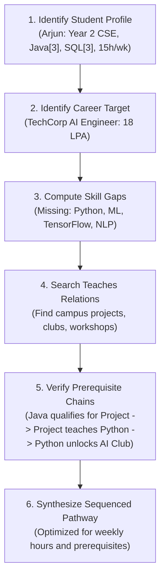

# Campus Genie
### Campus Opportunity Radar

**One-liner:**  
Turn fragmented campus data into personalized, explainable opportunity paths — powered by Databricks Genie.

**Primary Theme Alignment:** Theme 1 – Genie-Powered Campus Intelligence  
**Fit Strength:** 9.2 / 10

**Why Theme 1?**  
This project solves a real and painful student problem (fragmented campus opportunities) with a complete journey from natural language question → multi-hop reasoning → personalized sequenced path. Genie is the core intelligence engine, not an add-on. It directly addresses placement readiness, skill-gap analysis, club/event discovery, and research matching.

**Secondary Theme Elements (Theme 2):**  
Also contains strong “What if?” simulation and intelligent opportunity navigation capabilities.

---

## 📌 Slide 1: Title & Executive Summary

**Project Name:** Campus Opportunity Radar (Campus Genie)  
**Track:** Databricks Genie Hackathon  
**Core Thesis:** Turn disconnected campus data silos into a traversable Opportunity Graph, using Databricks Genie for multi-hop reasoning, personalized sequencing, and real-time "What-If?" re-planning.

> **🎤 Speaker Notes:**  
> *"Good morning judges. Every university student asks the same question: 'I know what career I want, but what should I do next on campus?' Today, we present Campus Opportunity Radar — a platform that turns fragmented campus data into clear, personalized, explainable career roadmaps using Databricks Genie."*

---

## 🔥 Slide 2: The Problem — The Campus Silo Paradox

University campuses overflow with opportunities, but they are trapped in isolated departmental silos:

| Silo | What the Student Sees | The Hidden Missing Link |
| :--- | :--- | :--- |
| **Course Catalog** | List of course codes & credits | No connection to industry career goals |
| **Student Clubs** | Meeting times & room numbers | No clear prerequisite or skill mapping |
| **Event Calendar** | Isolated dates for workshops | No relevance scoring for career paths |
| **Research Board** | Jargon-heavy faculty project titles | Prerequisite hurdles are invisible |
| **Hackathons** | Generic themes & prizes | No guidance on team roles or skill readiness |
| **Placement Portal** | High-stakes job descriptions (18 LPA) | No preparatory runway; gap discovered too late |

### The Real Student Pain
- **Sophomores miss foundational projects** because prerequisites aren't obvious until junior year.
- **Skill gaps remain invisible** until placement interview rejections reveal them brutally.
- **Mentorship is manual and inconsistent** — advisors cannot remember 500+ active campus opportunities.

> **🎤 Speaker Notes:**  
> *"Students don't suffer from a lack of opportunities — they suffer from a lack of connections. A 2nd-year student knows they want to be an AI Engineer, but nothing connects their current Java knowledge to a faculty NLP research lab or an 18 LPA TechCorp placement."*

---

## 💡 Slide 3: The Core Insight — Skills as the Universal Connector

Every campus opportunity either **requires** or **teaches** skills at measurable proficiency levels (1–5). 

```
[ Student Profile ] ──has──▶ ( Skill A [L3] ) ◀──requires── [ Backend Project ]
                                                                 │
                                                              teaches
                                                                 ▼
[ Placement: AI Eng ] ◀──requires── ( Skill C [L3] ) ◀──teaches── [ AI Club ]
```

### The Opportunity Graph
- A **Backend API Project** requires `Java[2]`, teaches `Python[2]` and `REST APIs[3]`.
- The **AI/ML Club** requires `Python[1]`, teaches `Machine Learning[2]` and `Statistics[2]`.
- An **Applied AI Workshop** deepens `TensorFlow[3]` and `Model Deployment[2]`.
- A **Faculty Research Lab** requires `ML[2] + Python[3]`, teaches `NLP[4]`.
- A **Tier-1 Placement Role** requires `Python[3] + ML[3] + NLP[2] + TensorFlow[2]`.

**These are not random events — they form a traversable, learnable graph.**

> **🎤 Speaker Notes:**  
> *"When we realized that skills are the universal join key across all campus tables, the architecture became obvious. We don't need a complex black-box recommendation model. We need a clean relational Opportunity Graph and an intelligence layer that can reason across it. That intelligence layer is Databricks Genie."*

---

## 🚀 Slide 4: Solution Overview — Databricks Genie as the Intelligence Layer

Campus Opportunity Radar turns natural-language questions into multi-hop graph traversals.

1. **Student Ingestion:** Student asks a natural question with their background, skills, and goals.
2. **Deterministic Graph Traversal:** Genie inspects 14–16 Unity Catalog tables, discovers prerequisites, and computes skill deltas.
3. **Sequenced Opportunity Cards:** Generates a step-by-step roadmap with time commitments, prerequisites, and milestone unlocks.
4. **Transparent Explainability:** Every recommendation answers *"Why this?"* by pointing to the exact skill gap it resolves.
5. **Dynamic "What If?" Adaptability:** Instantly recalculates the pathway when constraints (hours/week, existing skills) change.

> **🎤 Speaker Notes:**  
> *"Instead of building custom recommendation heuristics in Python, we let Databricks Unity Catalog hold the Opportunity Graph, and we let Genie do the multi-hop reasoning. Genie writes the exact SQL joins across 8+ tables and translates the result into human-readable steps."*

---

## 🧠 Slide 5: How Genie Reasons — The 6-Step Multi-Hop Chain

A single natural-language student prompt triggers an autonomous 6-step reasoning chain:



### What Makes This Intelligent (Not Just Search)
- **Multi-Table JOINs:** Traverses `students` → `student_skills` → `skills` → `project_skills` → `club_skills` → `research_skills` → `placement_skills`.
- **Proficiency-Aware:** Distinguishes between Level 1 (Awareness) and Level 4 (Advanced).
- **Prerequisite Validation:** Ensures a student is never recommended a Level 3 research lab before completing foundational Level 2 steps.

> **🎤 Speaker Notes:**  
> *"Look at this reasoning chain. This cannot be done with a single SELECT query or a standard vector search. Genie computes the delta between what Arjun knows and what TechCorp requires, finds the bridge opportunities, checks the prerequisite chain, and outputs a sequenced timeline."*

---

## 🏗️ Slide 6: System Architecture

A clean, decoupled 3-tier architecture where the **data model carries the relationships** and **Genie carries the reasoning**:

```
┌─────────────────────────────────────────────────────────────────────────┐
│                           PRESENTATION LAYER                            │
│   • Databricks Genie Space (Conversational Native UI)                   │
│   • Next.js App (Interactive Hand-Drawn Notebook Interface)             │
└────────────────────────────────────┬────────────────────────────────────┘
                                     │
                                     ▼
┌─────────────────────────────────────────────────────────────────────────┐
│                          INTELLIGENCE LAYER                             │
│   • Databricks Genie Space                                              │
│   • System Prompt & Reasoning Rules (genie_instructions.md)              │
│   • Natural Language to Multi-Table SQL Generator                       │
│   • "What-If?" Constraint Parser & Re-Planner                           │
└────────────────────────────────────┬────────────────────────────────────┘
                                     │
                                     ▼
┌─────────────────────────────────────────────────────────────────────────┐
│                              DATA LAYER                                 │
│   • Databricks Unity Catalog: campus_genie.opportunity_graph            │
│   • 14 Interconnected Entity & Junction Tables                          │
│   • Granular Metadata & Table Descriptions                              │
└─────────────────────────────────────────────────────────────────────────┘
```

> **🎤 Speaker Notes:**  
> *"Our architecture is deliberately elegant. The data layer in Unity Catalog stores the Opportunity Graph. Genie acts as the intelligence layer, executing deterministic SQL queries against Unity Catalog. The presentation layer offers both native Genie Space interaction and a rich web dashboard."*

---

## 📊 Slide 7: Data Model Highlights

The schema consists of **14 intentionally connected tables** in Unity Catalog:

```
                  ┌──────────────┐
                  │   students   │
                  └──────┬───────┘
                         │
                  ┌──────┴───────┐
                  │student_skills│
                  └──────┬───────┘
                         │
                  ┌──────┴───────┐
                  │    skills    │ ◀─── CENTRAL HUB
                  └──────┬───────┘
      ┌──────────┬───────┼───────┬──────────┬──────────┐
      │          │       │       │          │          │
┌─────┴─────┐ ┌──┴───┐ ┌─┴───┐ ┌─┴────┐ ┌───┴────┐ ┌───┴────┐
│projects   │ │clubs │ │event│ │facul.│ │hackath.│ │placem. │
│_skills    │ │_sk.  │ │_sk. │ │_sk.  │ │_skills │ │_skills │
└───────────┘ └──────┘ └─────┘ └──────┘ └────────┘ └────────┘
```

### Relational Density & Integrity
- **Proficiency Levels:** Calibrated 1 (Awareness) to 5 (Expert) on every skill link.
- **Bidirectional Relations:** `requires` vs. `teaches` on all opportunity junction tables.
- **Time Cost Attributes:** `weekly_hours` on every activity to model real student schedules.
- **Zero Hallucination:** 100% referential integrity across all foreign keys.

> **🎤 Speaker Notes:**  
> *"Every single row in our dataset serves the graph. We enforce proficiency levels and relation types on all junction tables so Genie always has precise constraints to calculate optimal pathways."*

---

## 🎬 Slide 8: Live Demo — The 90-Second Magic Moment

### Step 1: The Golden Question (0:00 – 0:30)
> *"I'm Arjun Mehta, a 2nd-year CSE student. I know Java and SQL at an intermediate level. My goal is to become an AI Engineer. What campus opportunities should I pursue and in what order?"*

### Step 2: Genie's Sequenced Response (0:30 – 0:55)

| Step | Duration | Opportunity | Type | Effort | Skill Built & Prerequisite Met |
| :---: | :---: | :--- | :---: | :---: | :--- |
| **01** | Wks 1–8 | **Campus Backend API** | Project | 6h/wk | Uses Java[3] → Teaches `Python[2]` & `REST APIs[3]` |
| **02** | Wks 3+ | **AI/ML Student Club** | Club | 4h/wk | Uses Python[1] → Teaches `Machine Learning[2]` & `Stats[2]` |
| **03** | Wks 5–6 | **Applied AI Workshop** | Workshop | 4h/wk | Uses Python[2]+ML[1] → Teaches `TensorFlow[3]` & `Deploy[2]` |
| **04** | Wks 7–16 | **NLP Research Lab (Dr. Kumar)** | Research | 8h/wk | Uses Python[3]+ML[2] → Teaches `NLP[4]` & `Deep Learning[3]` |
| **05** | Wk 10 | **DataHack 2026 Hackathon** | Hackathon | Wknd | Uses Python+ML → Proves `End-to-End ML[3]` & `Teamwork[3]` |
| **06** | Ready | **TechCorp AI Engineer** | Placement | — | **All 5 Skill Requirements 100% Met (18.0 LPA Offer)** |

> **🎤 Speaker Notes:**  
> *"Watch how Genie sequences this: Arjun doesn't know Python, so he can't join AI Club yet. Step 1 puts him on a Backend project that leverages his Java to teach him Python. Once he has Python, Step 2 unlocks AI Club. That unlocks the Applied AI Workshop, which qualifies him for Dr. Kumar's NLP research lab, leading directly to the 18 LPA placement."*

---

## 🔄 Slide 9: "What If?" Dynamic Re-Planning

Student circumstances change instantly. Genie re-evaluates constraints without restarting the conversation.

### Scenario A: Time Crunch (5 Hours / Week Limit)
> **Prompt:** *"What if Arjun only has 5 hours per week available?"*
- ❌ **Scribbles out:** 8h/week NLP Research Lab & 6h Backend Project.
- ✅ **Substitutes:** 3h/week Peer Python Study Cohort + 2h/week NLP Transformers Seminar.
- ⏱️ **Adjusts:** Extends overall timeline from 12 weeks to 20 weeks to protect academic balance.

### Scenario B: Prior Experience (Already Knows Python)
> **Prompt:** *"What if Arjun already knew Python at Level 3?"*
- ⏩ **Bypasses:** Step 1 (Backend Project).
- 🚀 **Fast-Tracks:** Direct day-one entry into AI Club and Research Lab — compresses pathway by 6 weeks.

### Scenario C: Goal Pivot (Switches to Data Scientist)
> **Prompt:** *"What if Arjun wanted to become a Data Scientist instead?"*
- 🔄 **Reroutes:** Directly harnesses Arjun's strong SQL[3] into Data Analytics Club, Econometrics Bootcamp, and Predictive Analytics Research.

> **🎤 Speaker Notes:**  
> *"This is the real power of graph reasoning over simple search. When Arjun says 'I only have 5 hours,' Genie doesn't just filter a table — it re-plans the entire multi-step trajectory, substitutes lighter opportunities, and adjusts the graduation timeline."*

---

## 👥 Slide 10: Multi-Stakeholder Value — Beyond the Student

Campus Opportunity Radar creates immediate utility for every constituent in the higher education ecosystem:

```
               ┌─────────────────────────────────────┐
               │    Campus Opportunity Radar Graph   │
               └──────────────────┬──────────────────┘
         ┌────────────────┬───────┴────────┬────────────────┐
         ▼                ▼                ▼                ▼
   ┌───────────┐    ┌───────────┐    ┌───────────┐    ┌───────────┐
   │ Students  │    │  Faculty  │    │ Placement │    │   Admin   │
   └───────────┘    └───────────┘    └───────────┘    └───────────┘
   Personalized     Qualified Lab    Pipeline Cohort  Curriculum Gap
   Career Paths     Recruiting       Readiness        Intelligence
```

- **👨‍🏫 Faculty:** *"Which students qualify for my NLP research grant?"* → Instant candidate matching based on verified prerequisite proficiencies.
- **💼 Placement Cell:** *"How many students meet >= 70% of TechCorp's AI criteria?"* → Pipeline visibility months before recruitment drives.
- **🏛️ Academic Deans & Admin:** *"Which skills have high industry demand but low student supply?"* → Data-driven syllabus modernization.
- **🤝 Student Clubs:** *"Which freshmen have prerequisite enthusiasm for our lead track?"* → Targeted talent discovery.

> **🎤 Speaker Notes:**  
> *"This is not a one-trick student chatbot. The same Opportunity Graph powers faculty research matching, gives the placement cell predictive pipeline tracking, and provides deans with curriculum gap analytics."*

---

## 🌍 Slide 11: Scalability & Future Roadmap

The Opportunity Graph schema is **campus-agnostic** — any university can plug in its datasets.

| Phase | Scope | Technical & Business Evolution |
| :--- | :--- | :--- |
| **v1 (Current)** | **Single Campus** | 16 Unity Catalog tables, Genie Space reasoning, dynamic Next.js UI |
| **v2 (Next)** | **Multi-Campus Federation** | Cross-campus opportunity sharing, inter-collegiate hackathon pooling |
| **v3 (Future)** | **City & Industry Layer** | Local tech ecosystem integration, corporate co-ops, alumni mentors |

### Enterprise Data Pipeline Ready
- Can ingest live data from **Canvas/Blackboard** (courses), **Handshake/Simplicity** (placements), and **CampusLabs** (clubs) via Databricks Lakeflow.

> **🎤 Speaker Notes:**  
> *"Our data model is universal. Whether it's a university with 5,000 students or a state system with 100,000, the schema remains identical. With Unity Catalog federation, we can scale this from a single campus to an entire state university system."*

---

## 🏆 Slide 12: Why Campus Genie Wins

| Judging Criterion | Why Campus Genie Stands Out |
| :--- | :--- |
| **1. Genuine Problem** | Solves the universal, acute pain of campus opportunity fragmentation. |
| **2. True Genie Intelligence** | Multi-hop reasoning across 8+ tables that cannot be achieved with basic SQL or keyword search. |
| **3. High-Quality Graph Data** | Relational, proficiency-calibrated, prerequisite-dense schema in Unity Catalog. |
| **4. Explainable by Design** | Every single recommendation answers *"Why?"* with explicit skill delta proofs. |
| **5. Dynamic Adaptability** | Real-time constraint re-planning (hours, skills, goals) with zero code changes. |
| **6. Multi-Stakeholder Impact** | Empowers students, faculty, placement officers, and university leadership. |

> **🎤 Speaker Notes:**  
> *"Judges, we didn't just build a demo. We built an intelligent system where the data model carries the connections and Databricks Genie carries the reasoning. It is explainable, scalable, and solves a real problem every one of us has experienced."*

---

## 🎯 Slide 13: Closing & Call to Action

> ### *"Every student starts from a different place.*  
> ### *Every student has different constraints.*  
> ### *Campus Opportunity Radar gives every student a personalized, explainable path to their dream career — powered by Databricks Genie."*

**Explore the Codebase & Demo:**
- 📁 **Repository:** `Campus-Genie`
- 📊 **Unity Catalog Schema:** `campus_genie.opportunity_graph`
- 🧠 **Genie Instructions:** `genie/genie_instructions.md`
- 💻 **Interactive UI:** Next.js Hand-Drawn App in `app/`

---

## ⚡ Quick Reference: Live Demo Cheat Sheet

### Golden Demo Question (Arjun Mehta)
```text
I'm Arjun Mehta, a 2nd-year CSE student. I know Java and SQL at an intermediate level. My goal is to become an AI Engineer. What campus opportunities should I pursue and in what order to reach my goal?
```

### What-If Follow-Up (5 Hours / Week Constraint)
```text
What if Arjun only has 5 hours per week available? Which opportunities can he still pursue to become an AI Engineer?
```

### What-If Follow-Up (Already Knows Python)
```text
If Arjun already knew Python at an intermediate level, how would his opportunity path to AI Engineer change?
```

### Faculty Perspective Backup Question
```text
Which students are qualified for Dr. Rajesh Kumar's NLP for Indian Languages research? Show their relevant skills and proficiency levels.
```

### Placement Cell Backup Question
```text
What are the top 10 most in-demand skills across all placement opportunities, and how many students currently have each skill at the required proficiency level?
```
